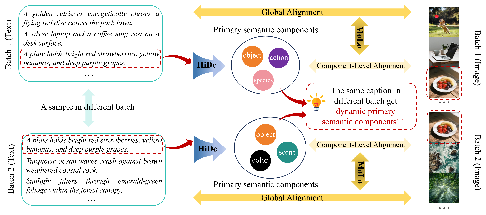
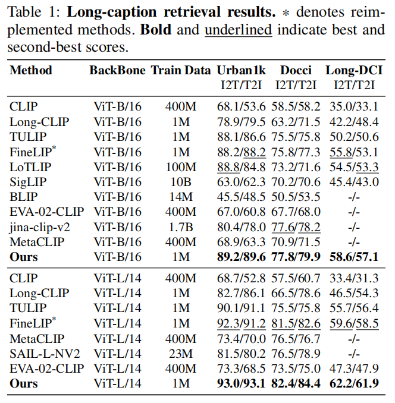
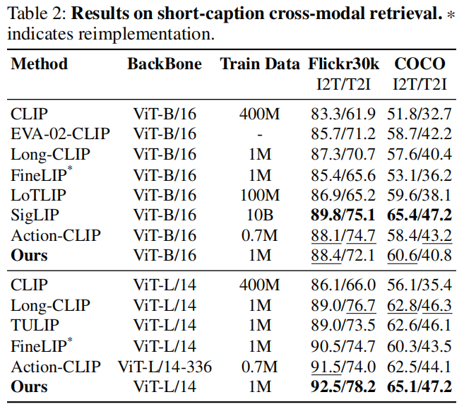
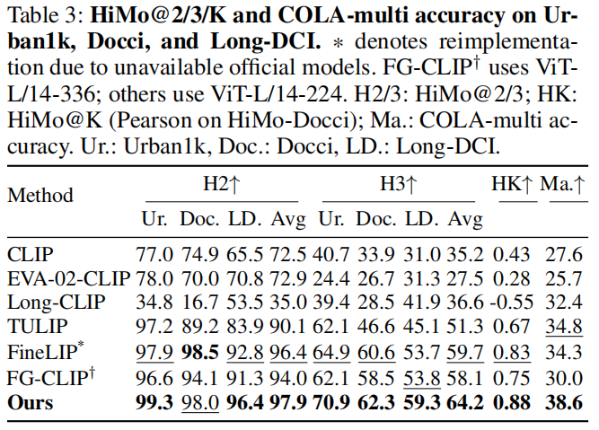
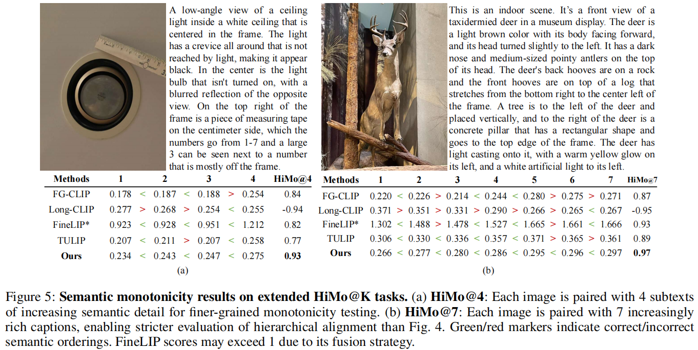

📚English | <a href="./README_CN.md">📚中文阅读 </a> 


# [AAAI 2026 Oral] HiMo-CLIP: Modeling Semantic Hierarchy and Monotonicity in Vision-Language Alignment

<div class="is-size-5 publication-authors" align="center">
  <span class="author-block">
    <a href="" target="_blank">Ruijia Wu</a><sup>1,2</sup><sup>†</sup>,&nbsp;
  </span>
  <span class="author-block">
    <a href="https://scholar.google.com/citations?hl=zh-CN&view_op=list_works&user=gpNOW2UAAAAJ" target="_blank">Ping Chen</a><sup>1,2</sup><sup>†</sup>,&nbsp;
  </span>
  <span class="author-block">
    <a href="https://muzishen.github.io/" target="_blank">Fei Shen</a><sup>3</sup>,&nbsp;
  </span>
  <span class="author-block">
    Shaoan Zhao<sup>1,2</sup>,&nbsp;
  </span>
  <span class="author-block">
    <a href="https://github.com/joelulu/" target="_blank">Huanlin Gao</a><sup>1,2</sup><sup>*</sup>,&nbsp;
  </span>
  <span class="author-block">
    Ting Lu<sup>1,2</sup>,&nbsp;
  </span>
  <span class="author-block">
    <a href="https://scholar.google.com/citations?hl=en&user=L4OXOs0AAAAJ" target="_blank">Zhaoxiang Liu</a><sup>1,2</sup>
  </span>
  <br>
  <span class="author-block">
    <a href="https://github.com/FangGet" target="_blank">Fang Zhao</a><sup>1,2</sup><sup>*</sup>,&nbsp;
  </span>
  <span class="author-block">
    <a href="https://scholar.google.com/citations?user=CFUQLCAAAAAJ&hl=en" target="_blank">Kai Wang</a><sup>1,2</sup>,&nbsp;
  </span>
  <span class="author-block">
    <a href="https://scholar.google.com.hk/citations?user=kCC2oKwAAAAJ&hl=zh-CN&oi=ao" target="_blank">Shiguo Lian</a><sup>1,2</sup><sup>*</sup>
  </span>
</div>

<div class="is-size-5 publication-authors" align="center">
  <span class="author-block"><sup>1</sup>Data Science & Artificial Intelligence Research Institute, China Unicom,&nbsp;</span><br>
  <span class="author-block"><sup>2</sup>Unicom Data Intelligence, China Unicom</span>
  <span class="author-block"><sup>3</sup>National University of Singapore</span>
</div>

<div class="is-size-5 publication-authors" align="center">
  († Equal contribution. * Corresponding author.)
</div>

<h5 align="center">
<a href="https://unicomai.github.io/HiMo-CLIP/" target="_blank">
  
</a>
<!-- <a href="" target="_blank">
  
</a> -->
</a>
<a href="./LICENSE" target="_blank">
  
</a>
<a href="https://github.com/UnicomAI/LeMiCa/stargazers" target="_blank">
  
</a>
</h5>


## Motivation

Contrastive vision-language models such as CLIP have shown remarkable performance in aligning images and text within a shared embedding space. However, they typically treat text as flat token sequences, ignoring the compositional and hierarchical nature of language. This simplification limits their ability to process complex and long-form descriptions, where multiple semantic levels coexist.

In particular, current models fail to capture two fundamental linguistic properties:
- **(1) Semantic Hierarchy** — the multi-level compositional structure of textual meaning, and
- **(2) Semantic Monotonicity** — the principle that richer or more complete descriptions should correspond to stronger alignment with the visual content.

These limitations motivate the design of **HiMo-CLIP**, which explicitly models both hierarchical and monotonic relationships between vision and language representations while remaining compatible with standard CLIP architectures.


*(a) Text descriptions of an image often grow in semantic richness, from short to long, by adding more visual details. (b) However, existing models, even those tailored for long-form text, often fail to preserve semantic monotonicity, overlooking this essential principle when scaling to richer descriptions. In contrast, HiMo-CLIP maintains alignment consistency across text granularities, effectively addressing this overlooked yet critical challenge. (Note: FineLIP’s similarity exceeds 1 due to its customized test-time scaling.)*

## Abstract

Contrastive vision-language models like CLIP have achieved impressive results in image-text retrieval by aligning image and text representations in a shared embedding space. However, these models often treat text as flat sequences, limiting their ability to handle complex, compositional, and long-form descriptions. In particular, they fail to capture two essential properties of language: semantic hierarchy, which reflects the multi-level compositional structure of text, and semantic monotonicity, where richer descriptions should result in stronger alignment with visual content.

To address these limitations, we propose HiMo-CLIP, a representation-level framework that enhances CLIP-style models without modifying the encoder architecture. HiMo-CLIP introduces two key components: a hierarchical decomposition (HiDe) module that extracts latent semantic components from long-form text via in-batch PCA, enabling flexible, batch-aware alignment across different semantic granularities, and a monotonicity-aware contrastive loss (MoLo) that jointly aligns global and component-level representations, encouraging the model to internalize semantic ordering and alignment strength as a function of textual completeness.

These components work in concert to produce structured, cognitively-aligned cross-modal representations. Experiments on multiple image-text retrieval benchmarks show that HiMo-CLIP consistently outperforms strong baselines, particularly under long or compositional descriptions.

## Methods

To address the above limitations, **HiMo-CLIP** introduces two lightweight, representation-level modules that can be seamlessly integrated into CLIP-style frameworks without altering the encoders:

*   **Hierarchical Decomposition (HiDe):**
    HiDe performs in-batch Principal Component Analysis (PCA) on textual embeddings to extract the most discriminative latent semantic components. These components dynamically adapt to batch context, revealing the intrinsic semantic hierarchy of each text sample. By aligning image representations with both global and component-level embeddings, HiDe enables fine-grained and multi-granular alignment.

*   **Monotonicity-aware Contrastive Loss (MoLo):**
    MoLo jointly aligns the image with its full-text embedding and its decomposed semantic components. This design enforces *semantic monotonicity* — ensuring that alignment strength increases as the text becomes more complete or informative. The loss encourages the model to internalize semantic ordering, leading to structured and cognitively aligned vision-language representations.

Both modules operate purely in the representation space, avoiding architectural modifications and additional supervision. Together, they allow HiMo-CLIP to efficiently capture hierarchical semantics and monotonic alignment properties, achieving superior performance across both long-text and short-text retrieval benchmarks.




## Performance

**HiMo-CLIP** consistently outperforms state-of-the-art methods across all long-text benchmarks. Under the ViT-L/14 backbone, our method achieves 93.0%/93.1%(I2T/T2I) on Urban1k, 82.4%/84.4% ((I2T/T2I)) on Docci, and 62.2%/61.9% (I2T/T2I) on Long-DCI, surpassing the strongest baseline (FineLIP) by pretty margins.





Figure 3 visualizes HiMo@5 trends on HiMo-Docci, where HiMo-CLIP consistently maintains monotonic similarity growth, unlike CLIP and Long-CLIP which often exhibit erratic drops, validating our core assumption that richer subtexts should yield stronger alignment. Figure 4 and Figure 5 extend this analysis with concrete examples for HiMo@2, @3, @4, and @7, showing that HiMo-CLIP reliably preserves correct score orderings even under deeper hierarchies. For instance, HiMo-CLIP achieves the highest qualitative HiMo@4 (0.93) and HiMo@7 (0.97), while FineLIP and TULIP exhibit score reversals, and Long-CLIP yields negative Pearson correlations ($-0.94$, $-0.95$). On shallower tasks, HiMo-CLIP maintains correct ordering at all steps, while FineLIP and TULIP show violations in HiMo@2 and HiMo@3, and even FG-CLIP fails on HiMo@3 despite strong quantitative scores. These results highlight the robustness and scalability of our representation-level alignment in modeling hierarchical semantic consistency across varied depths and content.




## License
The majority of this project is released under the **Apache 2.0 license** as found in the [LICENSE](./LICENSE) file.


## 📖 Citation
If you find **LeMiCa** useful in your research or applications, please consider giving us a star ⭐ and citing it by the following BibTeX entry:

```bibtex
  @inproceedings{,
    title     = {HiMo-CLIP: Modeling Semantic Hierarchy and Monotonicity in Vision-Language Alignment},
    author    = {Ruijia Wu and Ping Chen and Fei Shen and Shaoan Zhao and Qiang Hui and Huanlin Gao and Ting Lu and Zhaoxiang Liu and Fang Zhao and Kai Wang and Shiguo Lian},
    journal = {AAAI},
    year      = {2025},
    url       = {}
  }
```
